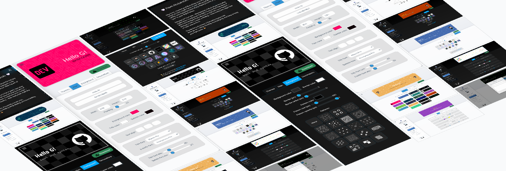

# ✨ Cover-Crest – A GitHub Profile Header Image Generator

*A spark of you, woven into code and canvas.* ✨



---


## ✨ Overview

**Cover-Crest** is a web-based tool that helps you design beautiful, personalized **GitHub profile header images** (or project banners).
It gives you complete control — themes, fonts, colors, patterns, decorations, and more — so your GitHub can carry a bit of your own soul and style.

> *"Because every digital space deserves a touch of its creator."* 🌿

* **Author:** Abdulrehman Gulfaraz
* **License:** MIT
* **Live Demo:** [Visit Cover-Crest on Netlify 🚀](https://cover-crest.netlify.app/)

---

## 🔥 Features

### 🎨 Interface & Layout

* Responsive **two-panel layout** (branding & instructions on left, toolbox on right).
* **Collapsible sidebar** on mobile (<768px).
* Built-in **Light/Dark mode toggle**.

### 🧩 Toolbox Tabs

The editor is divided into **4 clear tabs** for creativity:

1. **Themes**

   * Choose from **21 preset themes** (loaded dynamically from `themes.json`).
   * Each shown with a **visual preview thumbnail**.
   * "✨ Create My Own" button to jump into customization.

2. **Main Controls**

   * **Text inputs**: Title + Subtitle.
   * **Size controls**: Width, Height, Padding sliders.
   * **Colors**: Title, Subtitle, and Background color pickers.
   * **Alignment**: Left, Center, Right buttons.
   * **Fonts**: 26 fonts available (serif, sans, cursive, monospace).
   * **Font size sliders**: Adjustable 5px → 150px for both title and subtitle.

3. **Background**

   * Background + Border colors.
   * Border thickness + Radius (0 → 200px).
   * **Patterns**: 19 SVG-based patterns to overlay.
   * Pattern controls: Color, Size, Opacity sliders.

4. **Decorations**

   * **18 preset decoration images** (Octocats, dev icons, etc.).
   * Upload your **own decoration image**.
   * Size slider for decoration scaling.
   * Helpful links: Octodex + MyOctocat resources.

### 🖼 Image Output

* **Download** as high-resolution PNG (`github-header-banner.png`).

---

## 🌍 Deployment

* **Hosted on:** Netlify
* **Live link:** [https://cover-crest.netlify.app/](https://cover-crest.netlify.app/)

👉 *No setup required if you just want to try it out!*

---

## ⚙️ Getting Started

### Option 1: Use it Online 🌐

* Simply visit the live site: [Cover-Crest on Netlify](https://cover-crest.netlify.app/)
* Create your header → Download → Add to your GitHub profile README.

### Option 2: Run Locally 💻

```bash
# Clone the repository
git clone https://github.com/abdulrehmangulfaraz/cover-crest.git

# Navigate to project
cd cover-crest

# Install dependencies
npm install

# Run dev server
npm run dev

# Build for production
npm run build

# Preview build
npm run preview
```

---

## 🛠 Tech Stack

| Tool / Language  | Purpose                   |
| ---------------- | ------------------------- |
| HTML / CSS       | Core structure & styling  |
| JavaScript       | Interactivity & logic     |
| Node.js          | Backend rendering support |
| Canvas API / SVG | Image generation          |
| 💖 Creativity    | The secret ingredient     |

---

## 📂 File Structure

```plaintext
cover-crest/
├── index.html                 # Main entry point (injects partials)
├── vite.config.js             # Vite configuration
├── package.json               # Scripts & dependencies
├── LICENSE                    # MIT License
├── js/
│   ├── main.js                # Core entry JS
│   ├── tabs.js                # Tab logic
│   ├── toolbox-main.js        # Main tab functions
│   ├── toolbox-background.js  # Background tab functions
│   ├── toolbox-decorations.js # Decorations tab
│   ├── toolbox-presets.js     # Presets tab
│   ├── data/
│   │   ├── patterns.js        # SVG pattern definitions
│   │   └── themes.json        # Theme presets
│   └── helpers/               # Reusable helper functions
├── styles/
│   ├── index.scss             # Main stylesheet
│   ├── _variables.scss        # Theme variables
│   ├── _toolbox-main.scss     # Styling per tab
│   └── ...
├── partials/                  # Reusable HTML blocks
│   ├── head.html
│   ├── header.html
│   ├── footer.html
│   └── toolbox/*.html
├── public/
│   ├── images/
│   │   ├── decorations/       # Preset decorations
│   │   ├── patterns/          # Pattern thumbnails
│   │   └── theme-previews/    # Theme previews
│   └── site.webmanifest
```

---


## 📖 License

This project is licensed under the **[MIT License](LICENSE)**.

---

## 🤝 Contributions

Contributions are welcome! 🌟

* Fork the repo
* Create a new branch (`git checkout -b feature-name`)
* Commit your changes (`git commit -m "Add feature"`)
* Push the branch (`git push origin feature-name`)
* Open a Pull Request

---

## 📬 Contact & Credits

* **Author:** Abdulrehman Gulfaraz
* **GitHub:** [@abdulrehmangulfaraz](https://github.com/abdulrehmangulfaraz)
* **LinkedIn:** [Connect with me](https://www.linkedin.com/in/abdulrehman-gulfaraz/)

---

## 🖤 Final Note

*"Somewhere between code and creativity, a banner becomes more than pixels — it becomes presence."*

From Abdulrehman, with a Smile 🤍


